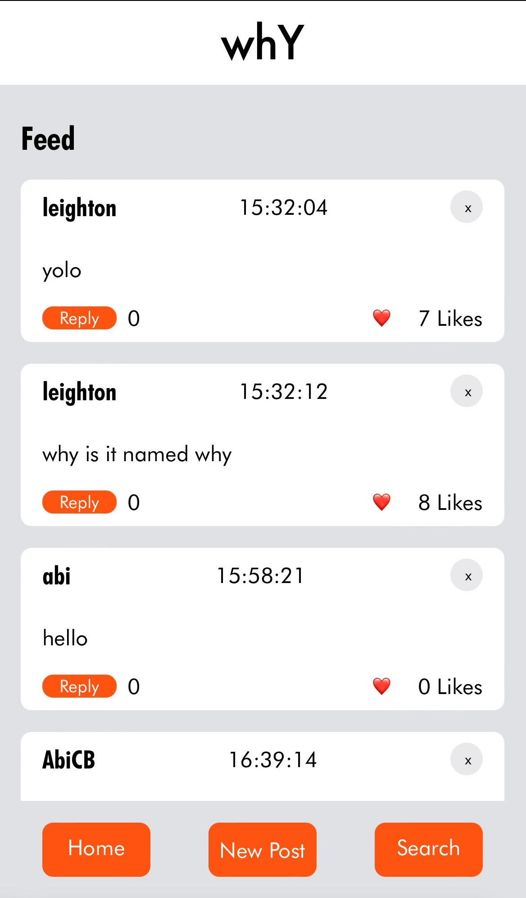
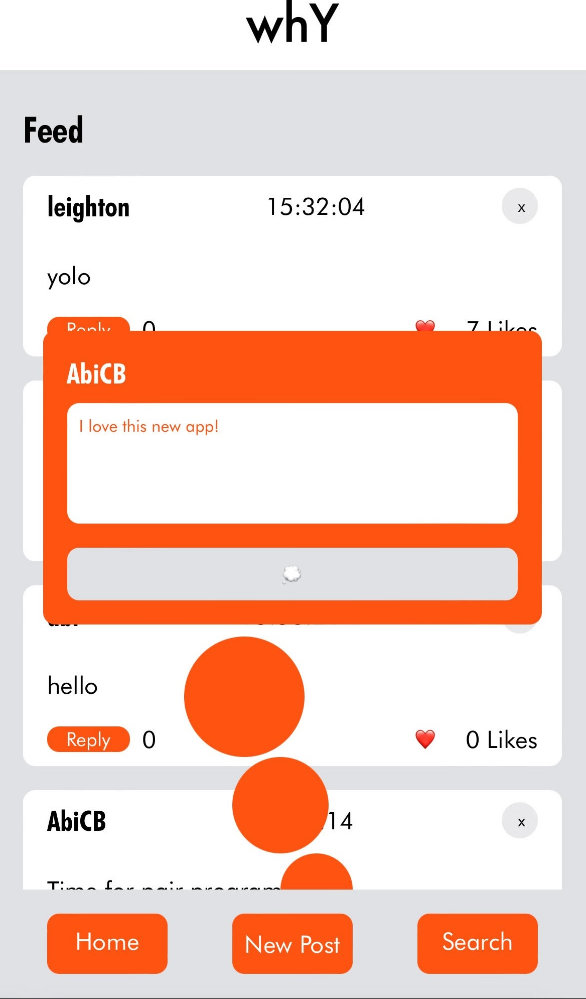
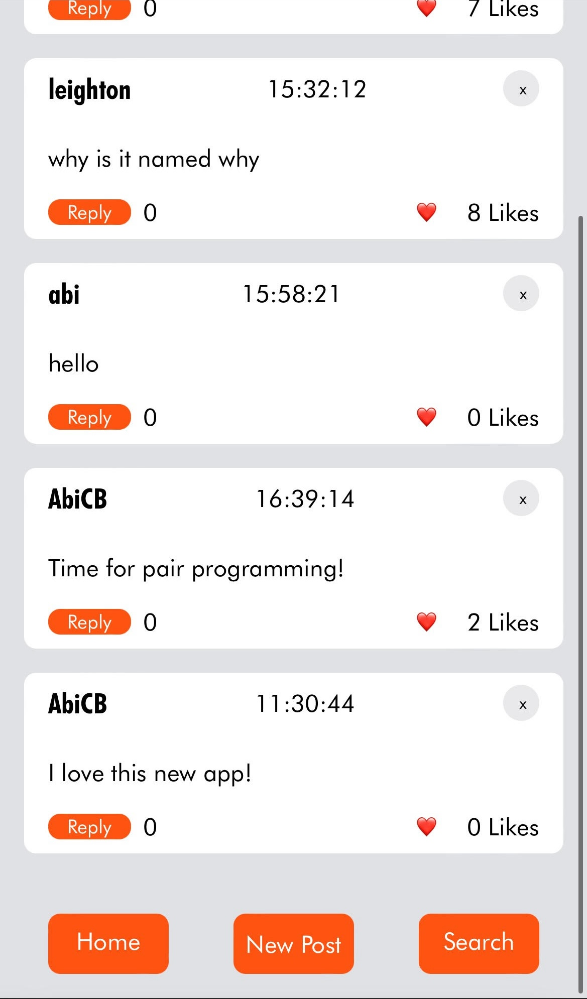
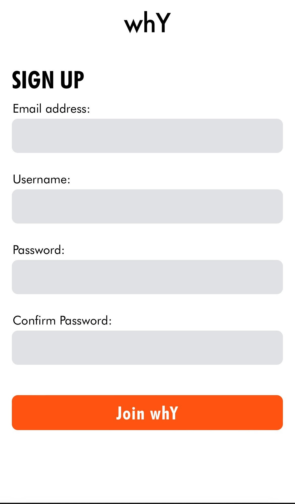
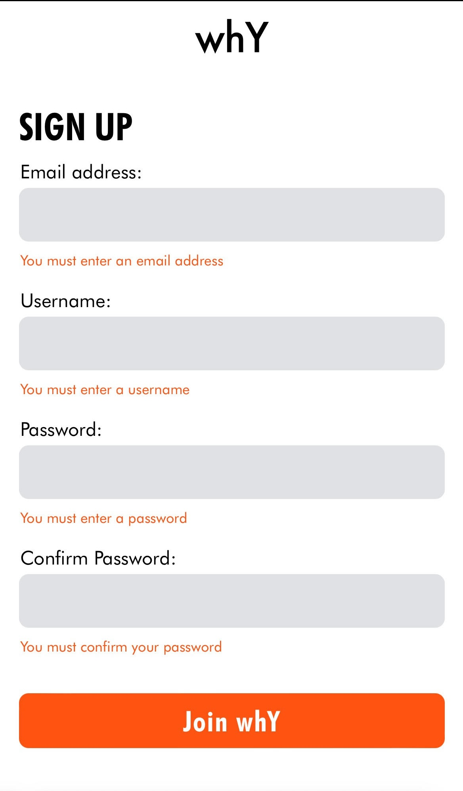

# whY

## Overview

A social media that ask the question whY?

24 hour hackathon full-stack project, working in collaboration with <a href="https://github.com/LeightonGuang" target=”_blank” >Leighton Guang</a>.

### Screenshots

